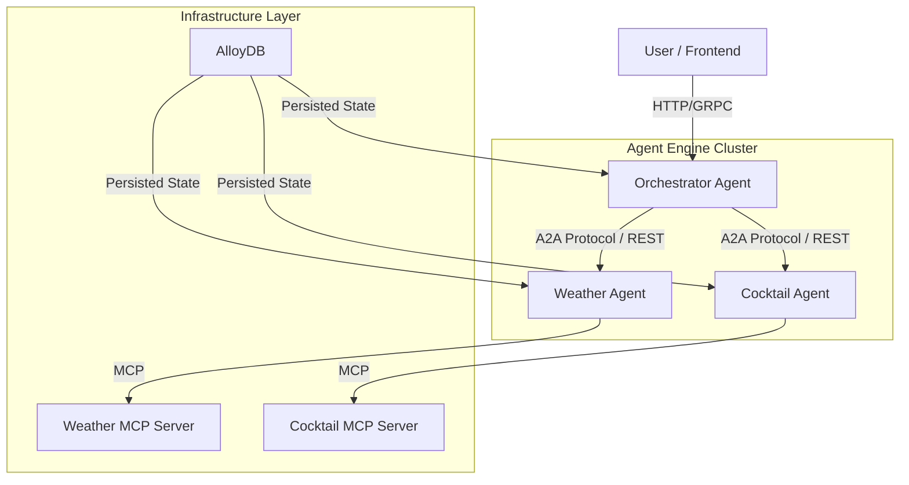

# Vibe Coding: A2A Master Architecture Guide

**Role:** Principal Software Architect  
**Context:** The definitive technical reference for the "Vibe Coding" Multi-Agent System using the **Agent-to-Agent (A2A)** protocol on Google Cloud's **Vertex AI Agent Engine**.

This document unifies the high-level architectural vision, deep-dive technical implementation details, and best practices/lessons learned.

---

## 1. High-Level Architecture: Hub-and-Spoke

We implemented a **Recursive Multi-Agent Architecture** using a **Stateful Orchestrator, Stateless Worker** pattern.

### Conceptual Topology



### Key Components

1.  **The Orchestrator (Root Node / Hub):**
    *   **Role:** The central "brain" that manages conversation state, user sessions, and task delegation. It possesses no inherent domain knowledge.
    *   **State:** **Highly Stateful.** Persists full conversation history and task metadata to **AlloyDB** to support long-running, multi-turn interactions.
    *   **Logic:** Uses a strict "Reasoning Loop" to break down user queries into discrete steps.

2.  **Specialized Agents (Spokes / Workers):**
    *   **Role:** Domain experts (Cocktail Agent, Weather Agent) that perform specific functions. They do not know about each other.
    *   **State:** **Stateless**. They receive a query, process it (e.g., call an external API via MCP), and return a structured JSON response. They use an ephemeral `InMemoryTaskStore` because they don't need to remember history across different orchestrator requests.
    *   **Benefit:** This decoupling allows the workers to crash, restart, or scale independently without affecting the user's conversation context.

3.  **MCP Servers (Tooling Layer):**
    *   Stateless Cloud Run services implementing the **Model Context Protocol**. They provide the raw I/O (API calls to weather services, database lookups for recipes) in a standardized format, decoupling the LLM from the API implementation details.

4.  **AlloyDB (State Layer):**
    *   The "Hippocampus." A centralized PostgreSQL instance that persists conversation history, task states (`PENDING`, `COMPLETED`), and session data. This moves state *out* of the ephemeral runtime memory, allowing the system to survive container restarts and scale horizontally.

## 1.1 Project Philosophy & Achievements

This project stands as a robust reference architecture for building advanced multi-agent systems on Google Cloud. While the specific domain (weather and cocktails) serves as an illustrative example, the underlying engineering decisions and implementations address core challenges inherent in developing production-ready, scalable, and resilient AI agent solutions.

Key achievements include:

*   **Distributed System Design:** Implementation of a true recursive multi-agent system, moving beyond monolithic agent designs to a decentralized "Orchestrator-Worker" topology.
*   **Stateful Resilience:** Pioneering the integration of AlloyDB for durable conversation and task state persistence, ensuring system resilience against ephemeral compute environments and enabling horizontal scalability.
*   **A2A Protocol Mastery:** Deep-seated implementation of the Agent-to-Agent protocol, showcasing secure, asynchronous communication patterns and critical context propagation across agent boundaries.
*   **Advanced Problem Solving:** Tackling complex challenges such as asynchronous database initialization within synchronous framework constraints, robust session ID translation layers, and structured LLM routing for deterministic execution.

This codebase demonstrates a commitment to solving real-world production challenges in the evolving landscape of AI agent development.

---

## 2. Codebase Organization & A2A Implementation

This section maps the high-level architecture to the specific files in the repository, highlighting how the **Agent-to-Agent (A2A)** pieces connect.

### The Directory Structure

```text
a2a-on-ae-multiagent-memorybank/a2a_agents/
├── orchestrator/           # The "Brain"
│   ├── card.py             # Identity (Agent Card)
│   ├── deploy.py           # Deployment Config
│   └── executor.py         # Runtime Logic
├── specialized/            # The "Limbs"
│   ├── weather/
│   └── cocktail/
└── shared/                 # The "Nervous System" (A2A Logic)
    ├── tools.py            # <--- CRITICAL: The A2A Client Implementation
    ├── base_executor.py    # <--- CRITICAL: The Runtime Container
    ├── auth_utils.py       # <--- CRITICAL: Secure S2S Authentication
    └── database/           # State Persistence
```

### The "Nervous System": Connecting the Agents

The most critical file for understanding the A2A implementation is **`shared/tools.py`**.

*   **What it does:** It implements the client-side logic for one agent to talk to another.
*   **Key Function:** `delegate_to_specialist_agent(agent_name, query)`
    *   **Discovery:** It looks up the target agent's URL from environment variables (e.g., `WEA_AGENT_URL`).
    *   **Authentication:** It uses `shared.auth_utils.GoogleAuth` to generate the necessary ID tokens for secure Service-to-Service communication on Google Cloud.
    *   **Protocol:** It constructs an `a2a.types.Message`, sends it via `httpx`, and receives a `Task` object.
    *   **Polling Loop:** This is the heartbeat of the A2A protocol in this implementation. Because the sub-agent might take time to think or call external APIs, the Orchestrator cannot just wait on a single HTTP request (which might timeout). Instead, it enters an `asyncio` loop, polling the `get_task(task_id)` endpoint until the status is `COMPLETED`.
    *   **Context Propagation:** It uses `contextvars` (`user_id_context`, `trace_id_context`) to propagate user identity and distributed trace IDs across asynchronous calls and agent boundaries. This enables user-specific memory retrieval and end-to-end observability.

### The "Brain": The Orchestrator

Located in **`orchestrator/executor.py`**.

*   **Configuration:** It registers the `delegate_to_specialist_agent` function as a **Tool** for the LLM.
*   **System Instructions:** The prompt explicitly tells the Orchestrator: *"You do not answer questions directly. You delegate them."*
*   **Structured Routing:** The Orchestrator enforces a strict JSON output format (`tool_name` vs `final_answer`). This turns the LLM into a deterministic state machine.

### The "Limbs": Specialized Agents

Located in **`specialized/*/executor.py`**.

*   **Inheritance:** These agents inherit from `BaseMcpAgentExecutor` (in `shared/base_executor.py`).
*   **MCP Integration:** Unlike the Orchestrator, these agents don't use the "delegate" tool. Instead, they are configured with **MCP Clients** that connect to the backend `mcp_servers`.
*   **Async Initialization:** The `_ensure_agent_initialized` method ensures that when a request comes in from the Orchestrator, the sub-agent can spin up its database connections without blocking the event loop using `asyncio.to_thread`.

---

## 3. Core Abstractions & Key Technical Highlights

### A. The `Task` Abstraction (A2A Protocol)
The system treats every interaction as a `Task`. A user query isn't just a chat message; it's a unit of work with a lifecycle (`Working` -> `Completed` | `Failed`).
*   **Mental Model:** Think of this as an async `Future` or `Promise` that lives in the database.
*   **Data Flow:** The Orchestrator spawns a `Task` on the Weather Agent. The Orchestrator then *polls* this task until it reaches a terminal state.

### B. The Sync/Async Bridge (Synchronous Builder Pattern)
*   **Context:** The `A2aAgent` framework requires a **synchronous** `task_store_builder` function during initialization, but cloud dependencies (Secret Manager, AlloyDB) are async.
*   **The Solution:** We implemented a **Synchronous Builder with Blocking Initialization** in `shared/database/connection.py`. It blocks the thread briefly only during the application's cold start to fetch credentials, then immediately constructs the `AsyncEngine`.
*   **Benefit:** Satisfies the framework's strict synchronous contract while ensuring runtime database operations remain fully asynchronous.

### C. Session ID Translation Layer (Composite Keys)
*   **The Problem:** A2A uses a client-provided `context_id`, but Vertex AI Agent Engine generates its own long, opaque resource names for sessions.
*   **The Solution:** A dedicated **Translation Layer** in `shared/database/sessions.py` using a **Composite Primary Key** (`user_id`, `context_id`).
*   **Benefit:** Allows looking up the correct Vertex Session Resource (`vertex_session_name`) instantly using the incoming A2A `context_id`, preventing "blank conversation" issues on follow-up messages.

---

## 4. "The Why" – Architectural Decision Record (ADR)

### Decision 1: Recursive Delegation vs. Monolithic Tool Use
*   **Context:** Why not just give the Orchestrator the "Weather Tool" and "Cocktail Tool" directly?
*   **Rationale:** **Context Window Hygiene & Cognitive Load.** By delegating, the Orchestrator doesn't need to see the schema of the weather API or the 50-line JSON output of a cocktail recipe. It only sees the *summary* returned by the sub-agent. This keeps the Orchestrator's context window clean for high-level reasoning.
*   **Trade-off:** **Latency.** Every delegation incurs network RTT, serialization/deserialization overhead, and a separate LLM inference step (approx. 12s total latency).

### Decision 2: Polling vs. WebSockets/Callbacks for A2A
*   **Context:** The Orchestrator polls the sub-agent for task completion.
*   **Rationale:** **Simplicity & Statelessness.** Cloud Run is stateless. Implementing long-lived WebSocket connections or async webhooks requires complex sidecar infrastructure. Polling is robust, easy to debug, and works over standard HTTP/1.1.
*   **Trade-off:** **"Chatty" Network Traffic.** Mitigated via Adaptive Exponential Backoff.

### Decision 3: Externalized State (AlloyDB)
*   **Context:** Moving `sessions` and `memory` from in-memory Python dictionaries to Postgres.
*   **Rationale:** **Production Readiness.** In-memory state implies that if the container crashes or scales to zero, the user loses their conversation. AlloyDB provides ACID compliance and allows multiple replicas to share state.

---

## 5. Critical Hotpaths

The most complex execution path is the **"Vibe Check" Query** (e.g., *"Weather in Seattle and a drink to match"*):

1.  **Ingest:** `Orchestrator` receives request.
2.  **Plan:** LLM identifies dependency: Weather must be known *before* Cocktail.
3.  **Step 1 (Blocking I/O Simulation):**
    *   Orchestrator calls `delegate_to_specialist_agent("Weather")`.
    *   **Optimization:** The `tools.py` logic initiates the task and starts polling (0.2s sleep + backoff).
    *   *Weather Agent* spins up, calls `Weather MCP`, interprets JSON, writes natural language summary to `Task.artifact`.
    *   Orchestrator reads artifact.
4.  **Context Synthesis:** Orchestrator injects Weather result ("Rainy, 49°F") into its context.
5.  **Step 2:**
    *   Orchestrator calls `delegate_to_specialist_agent("Cocktail")` with *refined query*: "Warming cocktail for rainy weather".
    *   *Cocktail Agent* uses semantic search (or LLM mapping) to select "Hot Toddy".
6.  **Final Synthesis:** Orchestrator combines both outputs into the final response.

**Key Observation:** The path is **strictly sequential**. The `Cocktail Agent` is idle while the `Weather Agent` is working. This is the primary bottleneck.

---

## 6. Technical Debt & Future Considerations

### A. The Latency Bottleneck (Sequential Execution)
*   **Current State:** `Step 1 -> await -> Step 2 -> await`.
*   **Future State:** The Orchestrator prompts need to be tuned to recognize *parallelizable* tasks. If a user asks "Weather in NY and Weather in London", the system should fire both delegations via `asyncio.gather`.

### B. Observability Fragmentation
*   **Current State:** Logs are verbose and split across services.
*   **Risk:** Losing the "story" of a request across microservices.
*   **Fix:** Enforce OpenTelemetry instrumentation at the library level rather than manual log injection.

### C. Connection Pooling
*   **Current State:** `asyncpg` with `SQLAlchemy`.
*   **Risk:** Connection exhaustion during scaling spikes.
*   **Fix:** Ensure `PgBouncer` is configured upstream or strictly limit the pool size.

### D. Framework Specifics
*   **The `task_store_builder` Constraint:** You *must* pass a callable builder to the `A2aAgent` constructor in `deploy.py`.
*   **Telemetry Imports:** Configuring custom telemetry often requires importing internal utilities from `vertexai.preview...`.
