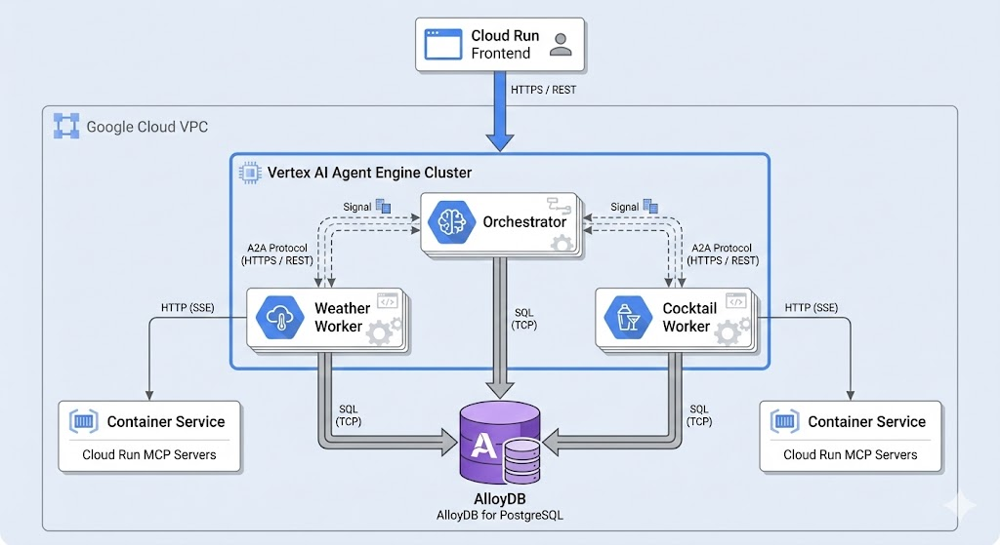

# Vibe Coding: Building a Stateful A2A Multi-Agent System

> **⚠️ DISCLAIMER**: THIS DEMO IS INTENDED FOR DEMONSTRATION PURPOSES ONLY. IT IS NOT INTENDED FOR USE IN A PRODUCTION ENVIRONMENT.
>
> **⚠️ Important**: A2A is in active development (WIP) thus, in the near future there might be changes that are different from what demonstrated here.
>
> **⚠️ Important**: Please run this lab in **Cloud Shell** to ensure you have the proper permissions.

## Overview
In this session, we will build and deploy a **stateful, production-ready multi-agent system** using the A2A (Agent-to-Agent) protocol. This system features an 'Orchestrator' agent that intelligently delegates tasks to specialized 'Weather' and 'Cocktail' agents. All agent memory, including task status and conversation history, is persisted in a robust **AlloyDB** database, ensuring the system is resilient and maintains context across interactions.

## Learning Objectives
By the end of this session, you will be able to:
- Understand the core concepts of the A2A protocol.
- Implement a persistent state management system for agents using AlloyDB.
- Understand the difference between task state, conversational state, and long-term memory.
- Deploy a tool-using agent (ADK) to Agent Engine.
- Implement secure agent-to-agent communication on Google Cloud.
- Deploy MCP (Model Context Protocol) servers on Cloud Run.

## Prerequisites
- `gcloud` CLI
- `uv` (Python package manager)
- `psql` (PostgreSQL interactive terminal)
- Python 3.12+
- Docker
- A Google Cloud Project with billing enabled.
- The following Google Cloud services enabled:
    - Cloud Run
    - Vertex AI
    - Cloud Build
    - Artifact Registry
    - **AlloyDB**
    - **Secret Manager**
    - Telemetry API 

## Step-by-Step Instructions

### 0. Authentication

Ensure your `gcloud` CLI is authenticated and configured for your Google Cloud project.
```bash
gcloud auth login
gcloud auth application-default login
```

### Enable Necessary APIs

Ensure all required Google Cloud APIs are enabled for the project.
```bash
gcloud services enable \
    run.googleapis.com \
    aiplatform.googleapis.com \
    cloudbuild.googleapis.com \
    artifactregistry.googleapis.com \
    iam.googleapis.com \
    cloudresourcemanager.googleapis.com \
    storage.googleapis.com \
    alloydb.googleapis.com \
    secretmanager.googleapis.com \
    servicenetworking.googleapis.com \
    compute.googleapis.com \
    telemetry.googleapis.com
```

### 1. Environment Setup

Run the configuration script. It will prompt you for your Project ID, Project Number, and a unique GCS Bucket Name. This creates a central `.env` file with all necessary environment variables.
```bash
./configure.sh
source .env
gcloud auth application-default set-quota-project $GOOGLE_CLOUD_PROJECT
```

### 2. Deploy the AlloyDB Database

This script provisions a new AlloyDB cluster and instance, creates the database and user, and stores the credentials securely in Secret Manager.
```bash
./deploy_alloydb.sh
```

### 3. Deploy Tooling Servers (MCP Servers)

Deploy the two backend tools (Cocktail and Weather APIs) that your specialized agents will call. This script deploys them to Cloud Run and updates your `.env` file with their URLs.
```bash
./mcp_servers/deploy_mcp_servers.sh
```

### 4. Deploy A2A Agents

This step deploys the Orchestrator, Cocktail, and Weather agents to Vertex AI Agent Engine. The `Orchestrator` agent intelligently delegates tasks to the specialized `Weather` and `Cocktail` agents. It discovers them by reading their Agent Card, which is like a 'business card' that describes what an agent can do. The deployment script will also automatically grant all necessary IAM permissions.

Run the following command to set up the virtual environment, install dependencies, and deploy all three agents:
```bash
(cd a2a-on-ae-multiagent-memorybank/a2a_agents && [ -d .venv ] || uv venv && source .venv/bin/activate && uv sync --python 3.12 && ./deploy_agents.sh)
```

*Note: To deploy a specific agent, use the `--cocktail`, `--weather`, or `--orchestrator` flags (e.g., `./deploy_agents.sh --orchestrator`).
This script will also save the agent URLs and Engine IDs in the root `.env` file.


### 5. Run the Frontend

You have two options for running the user-facing web interface: running it locally for quick testing, or deploying it to Google Cloud Run for a more permanent and shareable URL.

#### Option 5a: Run Locally

This is the fastest way to start interacting with your agent. The script will install dependencies and start the Gradio web server on your local machine.

```bash
(cd a2a-on-ae-multiagent-memorybank/frontend_option1 && [ -d .venv ] || uv venv && source .venv/bin/activate && uv sync --python 3.12 && ./deploy_frontend.sh --mode local)
```

After it starts, open your web browser to `http://127.0.0.1:8080`.

#### Option 5b: Deploy to Cloud Run

This option packages the frontend into a container and deploys it as a secure, scalable web service on Google Cloud.

```bash
(cd a2a-on-ae-multiagent-memorybank/frontend_option1 && [ -d .venv ] || uv venv && source .venv/bin/activate && uv sync --python 3.12 && ./deploy_frontend.sh --mode cloudrun)
```

The script will output the URL for your new Cloud Run service.

Additionally, you can create a secure local proxy to your Cloud Run service using the gcloud CLI. This is useful for testing or accessing the service from your local machine without exposing it to the public internet. The name of the service might vary depending on your configuration, but it will likely be `adk-frontend`.

```bash
gcloud run services proxy adk-frontend --region us-central1 --port 8081
```
This command will print a local URL (e.g., `http://127.0.0.1:8081`) that you can use to access the frontend.

### 6. Test the System

Open the URL for your frontend (either the local `http://127.0.0.1:8080`, the Cloud Run URL, or the proxied URL). You can now chat with your multi-agent system.

Here are several test cases, ranging from simple to complex, to validate the full capabilities of the agent.

**Test 1: Simple Delegation**
These queries test if the orchestrator can correctly route a single request to the appropriate specialized agent.
-   `Please get weather forecast for New York`
-   `What ingredients are in a Margarita?`

**Test 2: Vibe Checks (Semantic Mapping)**
These queries test the new "Vibe Mapping" logic where abstract requests are translated into concrete ingredient searches.
-   `I'm feeling cold and gloomy. Recommend a warming drink.` (Should suggest Whiskey/Rum/Hot drinks)
-   `It's a hot summer party! What should we serve?` (Should suggest Tequila/Gin/Fruity drinks)
-   `I want something sophisticated and classy.` (Should suggest Martinis or Old Fashioneds)

**Test 3: Weather-Influenced Cocktails (Contextual Synthesis)**
These queries require the Orchestrator to fetch weather first, then use that context to query the Cocktail Agent.
-   `What is the weather in Seattle, WA, and what cocktail would be good for it?`
-   `I'm in Miami. Check the forecast and suggest a drink that matches the vibe.`

**Test 4: Multi-Turn Conversation & Memory**
This sequence tests the agent's conversational memory, which is persisted in the AlloyDB session store.
1.  **First Turn:** `Give me a random cocktail.`
2.  **Second Turn:** `Great, what's the weather in a good city to drink that?`
    *The orchestrator should infer a relevant city (e.g., New Orleans for a Sazerac) and check its weather.*

**Test 5: Complex Reasoning & Origins**
This query requires extracting a specific detail (origin) to drive the next step.
-   `What is a Mojito, and what is the weather like in the city where it was invented?`
    *(Should identify Havana or Cuba -> Check Weather -> Synthesize)*

**Test 6: Error Handling & Boundaries**
Test the system's resilience and configured limitations.
-   `What is the weather in Paris, France?`
    *(Should politely decline because the Weather Agent is limited to the US)*
-   `Get weather for Narnia.`
    *(Should handle the "Location not found" error gracefully)*

## What We Just Built
Congratulations! You have successfully built a stateful multi-agent system.
- A **Gradio Frontend** (our client)
- Talked to an **Orchestrator Agent**
- Which discovered and called two **Specialized Agents** (Cocktail and Weather)
- Which in turn called their own **Tools** (the MCP Servers)
- Crucially, the entire system is **stateful**, with all task and conversation history persisted in a robust **AlloyDB** database.

Here is the architecture you deployed:


## Learn More
- [Agent Development Kit (ADK)](https://github.com/GoogleCloudPlatform/agent-development-kit)
- [Agent to Agent (A2A) Protocol](https://github.com/GoogleCloudPlatform/agent-development-kit/blob/main/docs/a2a.md)
- [Vertex AI Agent Engine](https://cloud.google.com/vertex-ai/docs/agent-engine/overview)

## Cleanup
To avoid incurring future charges, run the cleanup script. This will deprovision the agents, MCP servers, and the AlloyDB cluster.

```bash
./cleanup.sh
```
